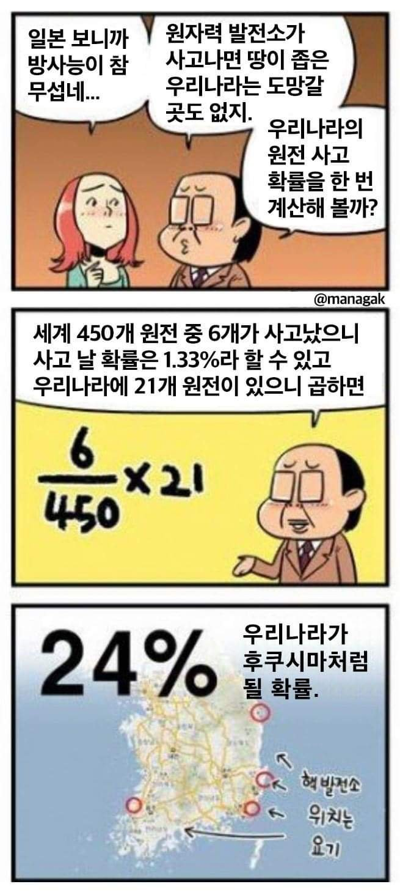

## New books to read
- None


## New links & blogs
- Don't Call Yourself A Programmer, And Other Career Advice (https://www.kalzumeus.com/2011/10/28/dont-call-yourself-a-programmer/)
  - Finding Great Developers (https://www.joelonsoftware.com/2006/09/06/finding-great-developers-2/)
- Do call yourself a programmer, and other career advice (http://yosefk.com/blog/do-call-yourself-a-programmer-and-other-career-advice.html)
- 비서 문제 (https://johngrib.github.io/wiki/secretary-problem/)


## What I've learned today

### Binomial theorem 의 뜻밖의 응용



- 트위터를 보다가, 위 만화를 놀리는 flow 가 있길래 따라서 같이 깔깔 거리고 있었다. 문득 그럼 실제로 우리나라에서 원전이 터질 확률은 얼마인지 계산해 보고 싶어서, 한번 시도해 봤다.

  -  where 
  - 원전이 하나라도 터질 확률 = 1 - (원전이 한 개도 터지지 않을 확률) 이기 때문에, 위와 같이 식을 세움

- 계산해 보니...

```ruby
p = Rational(6, 450); n = 21
(1 - ((1 - p) ** n)).to_f # => 0.24563838237657917
```

- 띠용? 24% 다. 정확히 24% 는 아니지만 만화에서 말하는 수치랑 거의 비슷하네. 왜 그럴까?
- 그 이유는 Binomial theorem (https://en.wikipedia.org/wiki/Binomial_theorem#Statement) 을 사용해 알아볼 수 있다. Binomial theorem 을 사용해서  을 전개해보자.
  -  
  - 위 식을 1 에서 빼면  로 시작하는 다항식이 되고,  가 충분히 작을 경우  이기 때문에  가 되는 것이다.
- 그렇다면 위의 근사를 모든 경우에 써먹을 수 있을까? 그렇진 않을 것이다.  가 충분히 작을 것이라는 가정을 해서 성립하는 것이므로, 가정을 깨트려 보면 되겠지.
- 산책하면서 추가로 얻은 인사이트
  -  의 의미는, 2개 이상의 원자력 발전소가 동시에 폭발할 확률이 거의 없음을 의미한다. 그러니까 , 즉 발전소 하나만 딱 폭발할 확률이, 원전이 하나라도 터질 확률이랑 같다 봐도 큰 문제는 없다는 뜻이다. 이런 측면에서 봤을 때, 만화에서 하는 계산이 말이 되지... 2개 이상 폭발할 확률은 지면상 생략한 것이다. ㅎㅎ.


