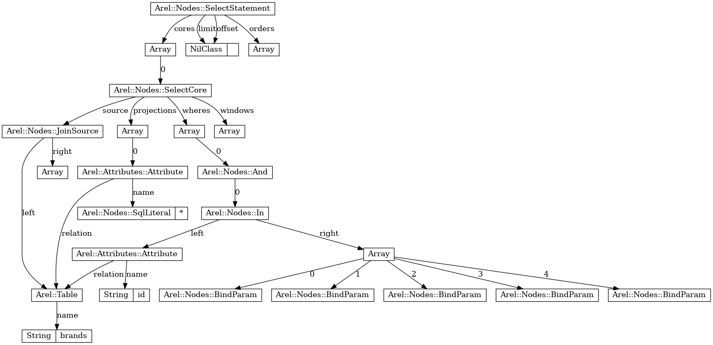
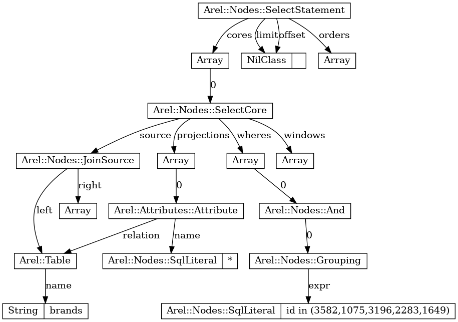

## Benchmarking & Profiling in Rails applications

### Life hack!

```ruby
# Warming up --------------------------------------
#       where with ids    60.000  i/100ms
#  where with sanitize    87.000  i/100ms
# Calculating -------------------------------------
#       where with ids    625.371  (± 2.1%) i/s -      3.180k in   5.087476s
#  where with sanitize    878.706  (± 4.6%) i/s -      4.437k in   5.063297s

# Comparison:
#  where with sanitize:      878.7 i/s
#       where with ids:      625.4 i/s - 1.41x  (± 0.00) slower

Benchmark.ips do |x|
  x.report("where with ids") do
    Brand.where(id: ids)
  end

  x.report("where with sanitize") do
    Brand.where(ActiveRecord::Base.sanitize_sql(["id in (?)", ids]))
  end

  x.compare!
end
```


### Where behavior

```ruby
# SELECT `brands`.* FROM `brands`
Brand.all.to_a; nil

# No query executed
Brand.all

# SELECT  `brands`.* FROM `brands` LIMIT 11
# IRB will do this for you.
Brand.all.inspect
```


### Fixed benchmark

```ruby
# Warming up --------------------------------------
#       where with ids     2.000  i/100ms
#  where with sanitize     3.000  i/100ms
# Calculating -------------------------------------
#       where with ids     35.121  (± 8.5%) i/s -    174.000  in   5.005230s
#  where with sanitize     42.088  (± 2.4%) i/s -    213.000  in   5.064063s

# Comparison:
#  where with sanitize:       42.1 i/s
#       where with ids:       35.1 i/s - 1.20x  (± 0.00) slower

Benchmark.ips do |x|
  x.report("where with ids") do
    Brand.where(id: ids).load
  end

  x.report("where with sanitize") do
    Brand.where(ActiveRecord::Base.sanitize_sql(["id in (?)", ids])).load
  end

  x.compare!
end
```


### Profiling

```ruby
StackProf.run(mode: :wall, out: "no_sanitize.dump") do |x|
  200.times do
    Brand.where(id: ids).load
  end
end

StackProf.run(mode: :wall, out: "sanitize.dump") do |x|
  200.times do
    Brand.where(ActiveRecord::Base.sanitize_sql(["id in (?)", ids])).load
  end
end
```


### Where profile

```bash
➜  fit-rails git:(develop) ✗ stackprof no_sanitize.dump
==================================
  Mode: wall(1000)
  Samples: 11532 (0.34% miss rate)
  GC: 1429 (12.39%)
==================================
     TOTAL    (pct)     SAMPLES    (pct)     FRAME
      1457  (12.6%)        1457  (12.6%)     Numeric#respond_to?
      1240  (10.8%)        1240  (10.8%)     ActiveRecord::Result#hash_rows
      2512  (21.8%)        1055   (9.1%)     Mysql2::Result#each
       801   (6.9%)         801   (6.9%)     (marking)
       623   (5.4%)         623   (5.4%)     (sweeping)
       346   (3.0%)         346   (3.0%)     ActiveRecord::ModelSchema::ClassMethods#inheritance_column
      1872  (16.2%)         345   (3.0%)     ActiveSupport::Callbacks#run_callbacks
       342   (3.0%)         342   (3.0%)     ActiveSupport::Callbacks::CallTemplate#expand
       399   (3.5%)         301   (2.6%)     ActiveRecord::Core::ClassMethods#allocate
       329   (2.9%)         300   (2.6%)     block (2 levels) in <module:AllocationTrackable>
       385   (3.3%)         289   (2.5%)     block (2 levels) in class_attribute
       270   (2.3%)         270   (2.3%)     ActiveRecord::Core#init_internals
       224   (1.9%)         224   (1.9%)     ActiveModel::LazyAttributeHash#initialize
       477   (4.1%)         197   (1.7%)     ActiveRecord::ConnectionAdapters::Quoting#quote
       196   (1.7%)         196   (1.7%)     ActiveRecord::Persistence::ClassMethods#discriminate_class_for_record
       648   (5.6%)         170   (1.5%)     ActiveRecord::PredicateBuilder::ArrayHandler#call
       256   (2.2%)         167   (1.4%)     ActiveRecord::ConnectionAdapters::Quoting#_quote
      2487  (21.6%)         159   (1.4%)     ActiveRecord::Core#init_with
       153   (1.3%)         153   (1.3%)     Mysql2::Client#query
       143   (1.2%)         143   (1.2%)     block (2 levels) in _define_after_model_callback
       122   (1.1%)         122   (1.1%)     NilClass#blank?
      5301  (46.0%)         117   (1.0%)     ActiveRecord::Result#each
       114   (1.0%)         114   (1.0%)     Arel::Collectors::PlainString#<<
       182   (1.6%)         112   (1.0%)     ActiveRecord::ModelSchema::ClassMethods#type_for_attribute
       108   (0.9%)         108   (0.9%)     ActiveSupport::CompareWithRange#cover?
       102   (0.9%)         102   (0.9%)     ActiveModel::Attribute#initialize
       922   (8.0%)         101   (0.9%)     ActiveSupport::Callbacks::Filters::After.halting_and_conditional
        97   (0.8%)          97   (0.8%)     block (4 levels) in class_attribute
       160   (1.4%)          96   (0.8%)     ActiveModel::Type::Helpers::Numeric#cast
        89   (0.8%)          89   (0.8%)     ActiveSupport::NumericWithFormat#to_s
```

```bash
➜  fit-rails git:(develop) ✗ stackprof sanitize.dump 
==================================
  Mode: wall(1000)
  Samples: 6146 (0.11% miss rate)
  GC: 1001 (16.29%)
==================================
     TOTAL    (pct)     SAMPLES    (pct)     FRAME
       893  (14.5%)         893  (14.5%)     Numeric#respond_to?
       773  (12.6%)         773  (12.6%)     ActiveRecord::Result#hash_rows
      1559  (25.4%)         705  (11.5%)     Mysql2::Result#each
       532   (8.7%)         532   (8.7%)     (marking)
       466   (7.6%)         466   (7.6%)     (sweeping)
      1111  (18.1%)         212   (3.4%)     ActiveSupport::Callbacks#run_callbacks
       225   (3.7%)         204   (3.3%)     block (2 levels) in <module:AllocationTrackable>
       202   (3.3%)         202   (3.3%)     ActiveRecord::ModelSchema::ClassMethods#inheritance_column
       201   (3.3%)         201   (3.3%)     ActiveSupport::Callbacks::CallTemplate#expand
       184   (3.0%)         184   (3.0%)     ActiveRecord::Core#init_internals
       212   (3.4%)         182   (3.0%)     ActiveRecord::Core::ClassMethods#allocate
       229   (3.7%)         172   (2.8%)     block (2 levels) in class_attribute
       124   (2.0%)         124   (2.0%)     ActiveModel::LazyAttributeHash#initialize
       109   (1.8%)         109   (1.8%)     ActiveRecord::Persistence::ClassMethods#discriminate_class_for_record
       150   (2.4%)         105   (1.7%)     ActiveRecord::ConnectionAdapters::Quoting#_quote
        94   (1.5%)          94   (1.5%)     Mysql2::Client#query
      1476  (24.0%)          92   (1.5%)     ActiveRecord::Core#init_with
        70   (1.1%)          70   (1.1%)     block (2 levels) in _define_after_model_callback
      3135  (51.0%)          69   (1.1%)     ActiveRecord::Result#each
        68   (1.1%)          68   (1.1%)     NilClass#blank?
       560   (9.1%)          59   (1.0%)     ActiveSupport::Callbacks::Filters::After.halting_and_conditional
        57   (0.9%)          57   (0.9%)     block (4 levels) in class_attribute
        56   (0.9%)          56   (0.9%)     ActiveModel::AttributeSet#initialize
        49   (0.8%)          49   (0.8%)     ActiveSupport::Callbacks::CallbackChain#empty?
        45   (0.7%)          45   (0.7%)     ActiveSupport::NumericWithFormat#to_s
        45   (0.7%)          45   (0.7%)     ActiveRecord::AttributeMethods::ClassMethods#define_attribute_methods
       221   (3.6%)          32   (0.5%)     ActiveRecord::ConnectionAdapters::Quoting#quote
        30   (0.5%)          30   (0.5%)     ActiveModel::AttributeSet::YAMLEncoder#decode
        24   (0.4%)          24   (0.4%)     #<Module:0x000055adabb7afa8>.convert
        23   (0.4%)          23   (0.4%)     ActiveRecord::ModelSchema::ClassMethods#attributes_builder
```


### Eliminate "slow_caller"

```ruby
def slow
  sleep 1
end

def slow_caller
  10.times {slow}
end
```

- Self VS Self + Children


### Where profile: sort by total

```bash
➜  fit-rails git:(develop) ✗ stackprof --sort-total no_sanitize.dump

==================================
  Mode: wall(1000)
  Samples: 11532 (0.34% miss rate)
  GC: 1429 (12.39%)
==================================
     TOTAL    (pct)     SAMPLES    (pct)     FRAME
     10103  (87.6%)           0   (0.0%)     block (2 levels) in <main>
     10103  (87.6%)           0   (0.0%)     block in <main>
     10103  (87.6%)           0   (0.0%)     <main>
     10103  (87.6%)           0   (0.0%)     <main>
      9426  (81.7%)           1   (0.0%)     ActiveRecord::Relation#load
      9425  (81.7%)           1   (0.0%)     ActiveRecord::Relation#exec_queries
      9425  (81.7%)           1   (0.0%)     ActiveRecord::Relation#skip_query_cache_if_necessary
      9406  (81.6%)           1   (0.0%)     #<Module:0x000055adab724058>#find_by_sql
      9405  (81.6%)          11   (0.1%)     ActiveRecord::Querying#find_by_sql
      5578  (48.4%)           0   (0.0%)     ActiveSupport::Notifications::Instrumenter#instrument
      5301  (46.0%)         117   (1.0%)     ActiveRecord::Result#each
      4073  (35.3%)           0   (0.0%)     ActiveRecord::ConnectionAdapters::MySQL::DatabaseStatements#select_all
      4070  (35.3%)           1   (0.0%)     ActiveRecord::ConnectionAdapters::QueryCache#select_all
      4069  (35.3%)           1   (0.0%)     ActiveRecord::ConnectionAdapters::DatabaseStatements#select_all
      3941  (34.2%)           1   (0.0%)     ActiveRecord::Persistence::ClassMethods#instantiate
      2799  (24.3%)           2   (0.0%)     ActiveRecord::ConnectionAdapters::MySQL::DatabaseStatements#exec_query
      2799  (24.3%)           0   (0.0%)     ActiveRecord::ConnectionAdapters::DatabaseStatements#select
      2797  (24.3%)           0   (0.0%)     ActiveRecord::ConnectionAdapters::AbstractMysqlAdapter#execute_and_free
      2512  (21.8%)        1055   (9.1%)     Mysql2::Result#each
      2487  (21.6%)         159   (1.4%)     ActiveRecord::Core#init_with
      1872  (16.2%)         345   (3.0%)     ActiveSupport::Callbacks#run_callbacks
      1563  (13.6%)           1   (0.0%)     ActiveRecord::Base#_run_initialize_callbacks
      1457  (12.6%)        1457  (12.6%)     Numeric#respond_to?
      1429  (12.4%)           5   (0.0%)     (garbage collection)
      1269  (11.0%)           1   (0.0%)     ActiveRecord::ConnectionAdapters::DatabaseStatements#to_sql_and_binds
      1267  (11.0%)          85   (0.7%)     Arel::Visitors::Reduce#visit
      1267  (11.0%)           0   (0.0%)     Arel::Visitors::Reduce#accept
      1267  (11.0%)           0   (0.0%)     ActiveRecord::ConnectionAdapters::DetermineIfPreparableVisitor#accept
      1266  (11.0%)           0   (0.0%)     Arel::Visitors::ToSql#visit_Arel_Nodes_SelectStatement
      1266  (11.0%)           0   (0.0%)     Arel::Visitors::MySQL#visit_Arel_Nodes_SelectStatement
```

```bash
➜  fit-rails git:(develop) ✗ stackprof --sort-total sanitize.dump             

==================================
  Mode: wall(1000)
  Samples: 6146 (0.11% miss rate)
  GC: 1001 (16.29%)
==================================
     TOTAL    (pct)     SAMPLES    (pct)     FRAME
      5145  (83.7%)           0   (0.0%)     block (2 levels) in <main>
      5145  (83.7%)           0   (0.0%)     block in <main>
      5145  (83.7%)           0   (0.0%)     <main>
      5145  (83.7%)           0   (0.0%)     <main>
      4879  (79.4%)           1   (0.0%)     ActiveRecord::Relation#exec_queries
      4879  (79.4%)           0   (0.0%)     ActiveRecord::Relation#skip_query_cache_if_necessary
      4879  (79.4%)           0   (0.0%)     ActiveRecord::Relation#load
      4866  (79.2%)           3   (0.0%)     ActiveRecord::Querying#find_by_sql
      4866  (79.2%)           0   (0.0%)     #<Module:0x000055adab724058>#find_by_sql
      3280  (53.4%)           0   (0.0%)     ActiveSupport::Notifications::Instrumenter#instrument
      3135  (51.0%)          69   (1.1%)     ActiveRecord::Result#each
      2291  (37.3%)           0   (0.0%)     ActiveRecord::Persistence::ClassMethods#instantiate
      1723  (28.0%)           0   (0.0%)     ActiveRecord::ConnectionAdapters::MySQL::DatabaseStatements#select_all
      1721  (28.0%)           0   (0.0%)     ActiveRecord::ConnectionAdapters::DatabaseStatements#select_all
      1721  (28.0%)           0   (0.0%)     ActiveRecord::ConnectionAdapters::QueryCache#select_all
      1708  (27.8%)           0   (0.0%)     ActiveRecord::ConnectionAdapters::AbstractMysqlAdapter#execute_and_free
      1708  (27.8%)           1   (0.0%)     ActiveRecord::ConnectionAdapters::MySQL::DatabaseStatements#exec_query
      1708  (27.8%)           0   (0.0%)     ActiveRecord::ConnectionAdapters::DatabaseStatements#select
      1559  (25.4%)         705  (11.5%)     Mysql2::Result#each
      1476  (24.0%)          92   (1.5%)     ActiveRecord::Core#init_with
      1111  (18.1%)         212   (3.4%)     ActiveSupport::Callbacks#run_callbacks
      1001  (16.3%)           3   (0.0%)     (garbage collection)
       938  (15.3%)           3   (0.0%)     ActiveRecord::Base#_run_initialize_callbacks
       893  (14.5%)         893  (14.5%)     Numeric#respond_to?
       773  (12.6%)         773  (12.6%)     ActiveRecord::Result#hash_rows
       565   (9.2%)           5   (0.1%)     ActiveSupport::Callbacks::CallbackSequence#invoke_after
       560   (9.1%)          59   (1.0%)     ActiveSupport::Callbacks::Filters::After.halting_and_conditional
       532   (8.7%)         532   (8.7%)     (marking)
       501   (8.2%)           4   (0.1%)     ActiveSupport::Callbacks::CallTemplate#make_lambda
       466   (7.6%)         466   (7.6%)     (sweeping)
```


### Stackprof comparison of particular method

```bash
➜  fit-rails git:(develop) ✗ stackprof --sort-total no_sanitize.dump --method Arel::Visitors::Reduce#accept


Arel::Visitors::Reduce#accept (/home/pjshwa/.rbenv/versions/2.7.1/lib/ruby/gems/2.7.0/gems/arel-9.0.0/lib/arel/visitors/reduce.rb:7)
  samples:     0 self (0.0%)  /   1267 total (11.0%)
  callers:
    1267  (  100.0%)  ActiveRecord::ConnectionAdapters::DetermineIfPreparableVisitor#accept
  callees (1267 total):
    1267  (  100.0%)  Arel::Visitors::Reduce#visit
  code:
                                  |     7  |       def accept object, collector
 1267   (11.0%)                   |     8  |         visit object, collector
                                  |     9  |       end
➜  fit-rails git:(develop) ✗ stackprof --sort-total sanitize.dump --method Arel::Visitors::Reduce#accept 


Arel::Visitors::Reduce#accept (/home/pjshwa/.rbenv/versions/2.7.1/lib/ruby/gems/2.7.0/gems/arel-9.0.0/lib/arel/visitors/reduce.rb:7)
  samples:     0 self (0.0%)  /     12 total (0.2%)
  callers:
      12  (  100.0%)  ActiveRecord::ConnectionAdapters::DetermineIfPreparableVisitor#accept
  callees (12 total):
      12  (  100.0%)  Arel::Visitors::Reduce#visit
  code:
                                  |     7  |       def accept object, collector
   12    (0.2%)                   |     8  |         visit object, collector
                                  |     9  |       end
```


### Target is:  `Arel::Visitors::Reduce#accept`

- A method used for generating **AST**s utilizing **Visitor Pattern**.
  - What is a Visitor Pattern? What is an AST?
- Results of graphviz dot




