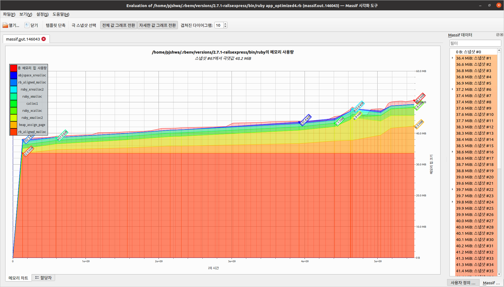

# Chapter 6. Profile Memory

Most of performance issues come from excessive memory usage

### Detect Excessive Memory Usage

- Use monitoring tools (New Relic, Heroku, ...)

### Profile Memory with Valgrind Massif



- Colors correspond to the ruby function consuming memory
    - Look through the call stack of the function, to see what calls these functions to allocate memory (`rb_init`, `rb_str_buf_new`, etc)
- x-axis represent time, y-axis represent memory amount
- Since Valgrind Massif only shows us the C call stack, we lack insight of what ruby code actually called those C functions

### Profile Object Allocations with Stackprof

- Samples the number of **object allocations** (not memory consumption)
- This is fine in most cases, but it won't work as a proxy of memory consumption if the program is using large objects

### Profile Memory with Ruby-Prof


```ruby
result = RubyProf.profile do

  str = 'x'*1024*1024*10
  str.upcase

end
```

- 3 star (*) operators allocate 3 strings
- `String#upcase` allocates another string

```ruby
result = RubyProf.profile do

  str = 'x'*(1024*1024*10)
  str.upcase!

end
```

- Only one string is allocated via star (*) operator
- `String#upcase!` does not allocate another string

### Measure Memory Yourself with GC#stat and GC::Profiler

- Indirect memory consumption check by doing this

```ruby
memory_before = `ps -o rss= -p #{Process.pid}`.to_i/1024
do_something
memory_after = `ps -o rss= -p #{Process.pid}`.to_i/1024
```

- Even more indirect check by seeing GC stats

```ruby
irb(main):001:0> GC.stat
=> {:count=>20, :heap_allocated_pages=>104, :heap_sorted_length=>122, :heap_allocatable_pages=>18, :heap_available_slots=>42392, :heap_live_slots=>42254, :heap_free_slots=>138, :heap_final_slots=>0, :heap_marked_slots=>29871, :heap_eden_pages=>104, :heap_tomb_pages=>0, :total_allocated_pages=>104, :total_freed_pages=>0, :total_allocated_objects=>148047, :total_freed_objects=>105793, :malloc_increase_bytes=>492400, :malloc_increase_bytes_limit=>16777216, :minor_gc_count=>16, :major_gc_count=>4, :compact_count=>0, :remembered_wb_unprotected_objects=>274, :remembered_wb_unprotected_objects_limit=>546, :old_objects=>29049, :old_objects_limit=>58102, :oldmalloc_increase_bytes=>1801984, :oldmalloc_increase_bytes_limit=>16777216}
irb(main):002:0> GC::Profiler.enable
=> nil
irb(main):003:0> y = "y"*1024*1024*100; nil
=> nil
irb(main):004:0> GC::Profiler.report
GC 21 invokes.
Index    Invoke Time(sec)       Use Size(byte)     Total Size(byte)         Total Object                    GC Time(ms)
    1               0.167                    0                    0                    0         0.86276700000001427249
=> nil
```